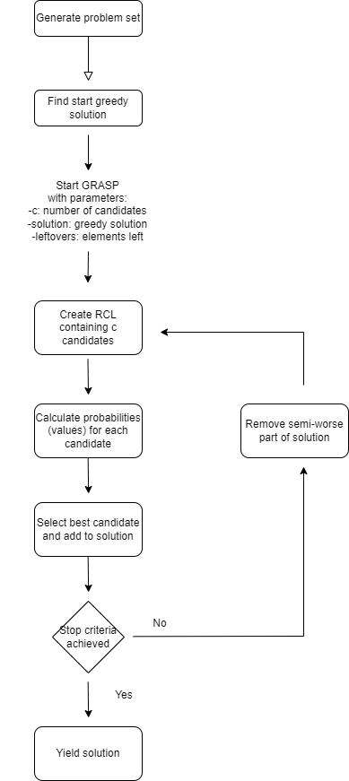

Opis problemu:

Znaleźć niepuste i niezależne podzbiory, które muszą sumować się do danego T, zostawiając zarazem najmniej leftovers. Jeśli algorytm nie wykorzysta wszystkich elementów, to dostaje karę od ilości pozostawionych elementów. Kiedy kara jest inf to algorytm szuka rozwiązania pokrywającego cały zbiór.

Czy trzeba zrobić solver który znajdzie optimum?

**TODO**
* Metaheurytyka do greedy? Np. GRASP
* Coś jeszcze

Porównanie algorytmów, jakiś wykres czy cuś:
- Auto wyznaczanie T
- Dane T

***
Najważniejszcze rzeczy w projekcie:

generator.py
- generate_set_with_guaranteed_solution -> generowanie problemu, który zawsze ma rozwiązanie
- generate_random_set -> generowanie losowego problemu bez żadnych gwarancji

global_functions.py
- calculate_penalty -> obliczyć karę dla danego solution, na ten moment kara to liczba leftovers/liczba wszystkich elementów (basically %)

greedy_solver.py
- basic_quadratic_greedy_solution -> zachłanne rozwiązanie

***
## GRASP approach
